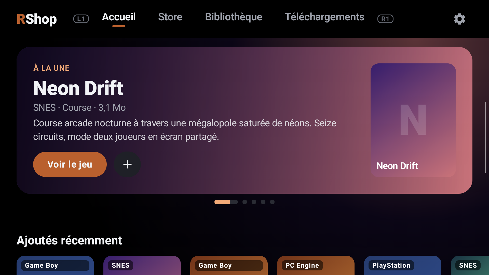
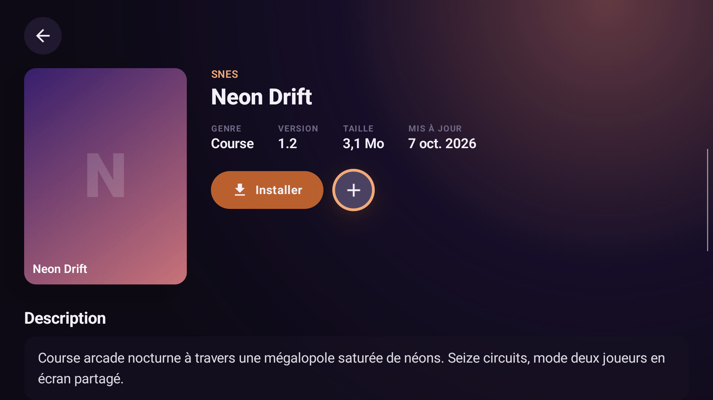
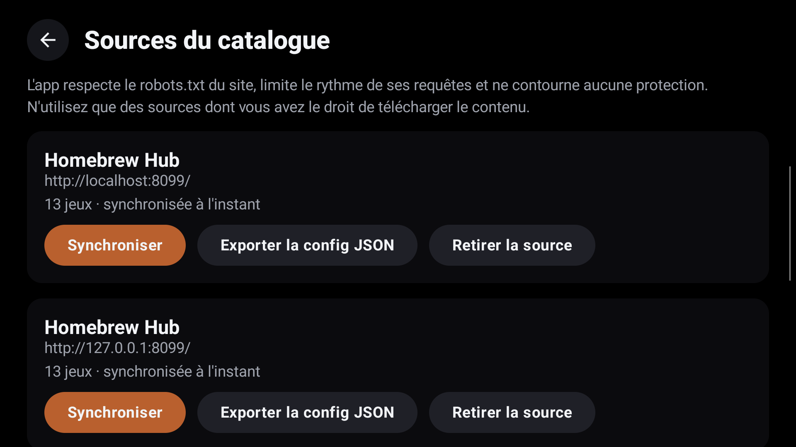
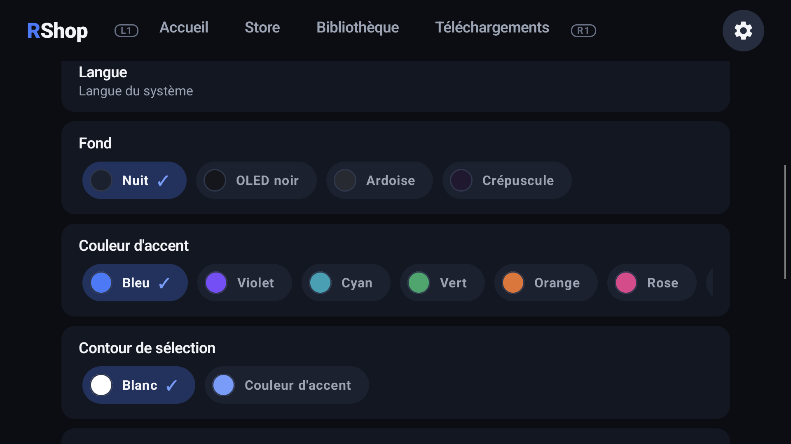

# RShop

**Un game store pour consoles portables Android** : parcourir un catalogue, télécharger, installer et gérer ses jeux, avec une interface pensée pour la manette, façon store de console.

RShop est **uniquement un store et un gestionnaire de téléchargements/installation**. Il ne lance pas les jeux : le lancement reste le rôle de votre frontend ou de vos émulateurs. Il ne fournit **aucun catalogue** : vous ajoutez vous-même les sites dont vous avez le droit de télécharger le contenu (homebrew, créations personnelles, contenu libre de droits, votre propre serveur…).

Conçu en priorité pour les Retroid, Ayn, Anbernic et consorts (écran 16:9, manette), il fonctionne aussi sur un téléphone ou une tablette Android 13+.

| Accueil | Fiche d'un jeu |
|---|---|
|  |  |
| **Sources du catalogue** | **Apparence** |
|  |  |

*Les captures utilisent un site de test fictif (`tools/testsite`).*

## Fonctionnalités

- **Accueil** : carrousel « À la une » des jeux les plus téléchargés (avec barre de progression avant le défilement), étagères *Consultés récemment*, *Favoris*, *Ajoutés récemment*, *Populaires*, *Mis à jour*, catégories et plateformes.
- **Store** : recherche instantanée (et recherche sur le site source), filtres par plateforme, genre (tags détectés depuis le site, le titre et la description) et source, tris (titre, populaires, récents, taille), chargement progressif pour les très gros catalogues.
- **Plusieurs sources de catalogue** en parallèle, chacune synchronisée en arrière-plan dans une base locale (Room) : l'app reste utilisable hors ligne. Une fois un site entièrement scanné, les synchronisations suivantes ne cherchent que les nouveaux jeux (« Tout rescanner » pour tout relire).
- **Téléchargements** en arrière-plan : progression, vitesse, temps restant, pause, reprise, annulation, nouvelle tentative, vérification SHA-256 quand le site la publie.
- **Installation** automatique dans le dossier de votre choix (Storage Access Framework) : `.zip`, `.7z`, `.tar`, `.tar.gz`, `.tar.xz`… avec protection contre le *path traversal* et les *zip bombs*. Plusieurs formats par jeu (ZIP, CHD, ISO…) : vous choisissez.
- **Navigateur intégré** (GeckoView) pour les sites qui passent par des pages intermédiaires : le fichier cliqué est récupéré directement par l'app et installé, même si vous fermez le navigateur.
- **Favoris et listes personnalisées** : un onglet dédié, des listes créées/renommées/supprimées à volonté, jeux ajoutés depuis leur page.
- **Bibliothèque** des jeux installés : informations, mise à jour, suppression.
- **Manette de bout en bout** : focus toujours visible, L1/R1 pour changer d'onglet, retour au jeu précédemment sélectionné, clavier ouvert seulement sur appui.
- **Personnalisation** : fonds (Nuit, OLED noir, Ardoise, Crépuscule), 7 couleurs d'accent, contour de sélection, taille du texte, arrière-plans dynamiques, langue (français / anglais).
- Reste en **paysage**, plein écran.

## Respect des sites

Le scraper est un module indépendant (`:scraper`, JVM pur) et :

- respecte `robots.txt` et limite le rythme de ses requêtes ;
- **ne contourne jamais** CAPTCHA, protections anti-bot, DRM, paywalls ou authentification ;
- ne télécharge jamais de fichier exécutable en silence et valide les URL, tailles, types de fichier, hash et chemins d'extraction.

N'ajoutez que des sources dont vous avez le droit d'utiliser le contenu. Vous êtes responsable de ce que vous téléchargez.

## Installer

1. Téléchargez `RShop-*-arm64.apk` depuis la page [Releases](../../releases).
2. Autorisez l'installation d'apps depuis cette source, puis ouvrez le fichier.
3. Au premier lancement : *Paramètres → Dossier des jeux* (où seront installés les jeux), puis *Paramètres → Sources du catalogue → Ajouter une source*.

**Avec [Obtainium](https://github.com/ImranR98/Obtainium)** (installation et mises à jour automatiques depuis les releases GitHub) : [ajouter RShop dans Obtainium](obtainium://add/https://github.com/AnimatrixEX/RShop), ou *Ajouter une app* puis coller `https://github.com/AnimatrixEX/RShop`. Aucune option à changer.

Prérequis : Android 13 (API 33) ou plus, processeur **arm64** (la quasi-totalité des consoles portables et des téléphones récents). Compter ~200 Mo : GeckoView, le moteur du navigateur intégré, embarque son code natif.

### Ajouter une source

Collez l'adresse d'une page qui liste les jeux (ou les consoles) : RShop analyse le site et propose une configuration (cartes, pagination, recherche, fiches, téléchargements, compteur de téléchargements…) avec un aperçu. Vous pouvez aussi importer/exporter une configuration JSON (`ScraperConfig`) pour un site qui demande des réglages précis.

Les jaquettes ne viennent pas des sites : elles sont cherchées sur [SteamGridDB](https://www.steamgriddb.com/) avec votre propre clé API gratuite (*Paramètres → Jaquettes*), stockée chiffrée sur l'appareil. Sans clé, les jeux s'affichent avec une vignette générée.

## Compiler

Prérequis : JDK 17+ (le projet est testé avec JDK 21) et le SDK Android (API 37).

```bash
./gradlew installDebug              # APK de debug (applicationId com.rshop.debug)
./gradlew :scraper:test :app:testDebugUnitTest   # tests
./gradlew :app:assembleRelease      # APK release (arm64)
```

Le build *debug* est livré avec un petit catalogue fictif et autorise le HTTP en clair vers `localhost` seulement (pour le site de test). Pour signer l'APK *release*, définissez dans `~/.gradle/gradle.properties` : `RSHOP_KEYSTORE`, `RSHOP_KEYSTORE_PASSWORD`, `RSHOP_KEY_ALIAS`, `RSHOP_KEY_PASSWORD` ; sans eux, l'APK release n'est pas signé.

### Site de test local

```bash
python tools/testsite/server.py --rate 4          # http://localhost:8099/consoles
adb reverse tcp:8099 tcp:8099
```

Jeux fictifs (pages intermédiaires, redirections, pop-ups publicitaires, formats multiples, hash…), débit réglable (`--rate` en Mo/s, `--chunk` en Ko) pour observer pause, reprise et progression.

## Architecture

```
app/        Kotlin · Jetpack Compose · Material 3 · Hilt · Room · WorkManager · Coil · GeckoView
 ├─ data/        database (Room), repository, sync, artwork, source (multi-sources), storage (SAF)
 ├─ domain/      modèles et interfaces de repository
 ├─ download/    DownloadManager, DownloadWorker (reprise Range/ETag, SHA-256)
 ├─ installation/ extraction d'archives, installation dans le dossier SAF
 └─ ui/          home, store, details, downloads, library, settings, source, browser, components, theme
scraper/    module JVM pur (Jsoup, OkHttp) : GameSource, WebsiteSource, SiteAnalyzer, ScraperConfig
tools/testsite/   site de test local
```

MVVM, pattern Repository, coroutines / Flow. Le parsing HTML ne touche jamais l'interface : `Scraper → Website Adapter → Parser → modèle → base locale → UI`.

## État du projet

Version 0.1.4, usage personnel. Le projet suit les phases décrites dans [`CLAUDE.md`](CLAUDE.md) (le lanceur de jeux en est volontairement exclu). Testé sur Retroid Pocket 6.
